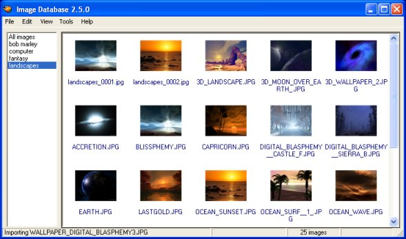



## Image Database 2\.5\.0 \(w/ thumbnails\)

### Description

Collects and stores all your images into a single MDB database. You can view the images found the database as thumbnails, detailed list, or simple list. You can also export the images back out fo the database. Too many features to list. Just be sure the read the readme included. Used only basic controls in the project. No need for any outside ocxs. Just load and run. This program does however require Windows XP or GDIPlus.dll (not included of course)(Google itif you need it.) This is still a work in progress so take that for what it is... Enjoy and I hope someone learns something from it. Or least what not to do. LOL

Whats New:

* Ability to resize category/preview panes

* Fixed bug with importing multiple images

* Added slideshow feature

* Supports single or multiple deletes

* Revised options form

* Fixed the copy to clipboard feature

* Autorename tool is now working (and fast)

* Show image details in status bar

* Create new databases ready to use

* Ability to compact the database

* Ability to choose a new database

* Cleaned up the about screen

* Revised the optiosn form

* Added refresh menu option to listview
 
### More Info
 

             |
---                |---
**Submitted On**   |2005-03-11 13:20:56
**By**             |[L\. M\. Trivette ](https://github.com/Planet-Source-Code/PSCIndex/blob/master/ByAuthor/l-m-trivette.md)
**Level**          |Advanced
**User Rating**    |5.0 (65 globes from 13 users)
**Compatibility**  |VB 6\.0
**Category**       |[Complete Applications](https://github.com/Planet-Source-Code/PSCIndex/blob/master/ByCategory/complete-applications__1-27.md)
**World**          |[Visual Basic](https://github.com/Planet-Source-Code/PSCIndex/blob/master/ByWorld/visual-basic.md)
**Archive File**   |[Image\_Data1863613112005\.zip](https://github.com/Planet-Source-Code/l-m-trivette-image-database-2-5-0-w-thumbnails__1-59422/archive/master.zip)

